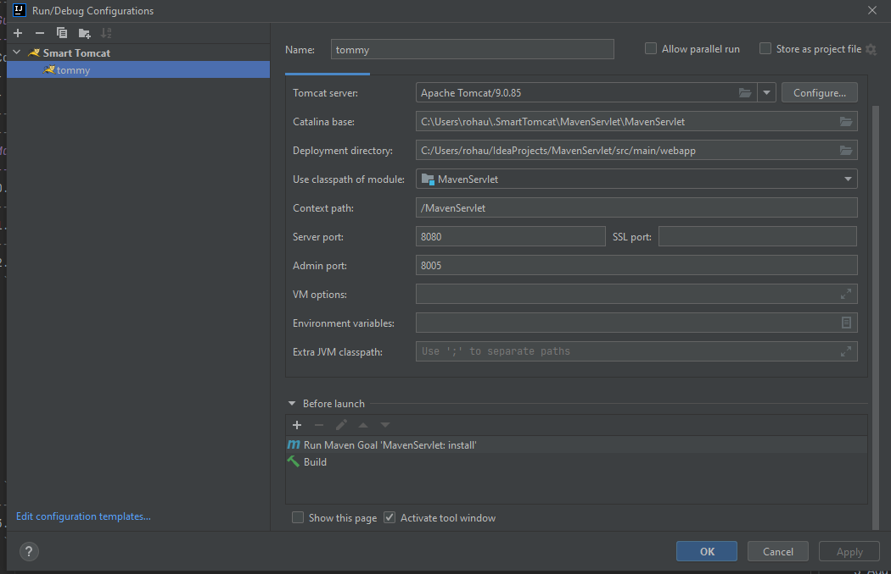

---
Deploy
---
1) Run maven "install"
2) copy target/MavenServlet-1.0-SNAPSHOT.war to
   C:\dev\apache-tomcat-8.5.70\webapps
3) Run C:\dev\apache-tomcat-8.5.70\bin\startup.bat
4) Go to http://localhost:8080/MavenServlet-1.0-SNAPSHOT/

or use Smart Tomcat plugin in Idea
NB! Do not forget to add mvn install goal before build in "Before launch" section

    

---
Guide to create servlet from scratch
---
Content:
- Maven Servlet Guide
- Raw Servlet Guide
---
---
Maven Servlet
---
0. New project -> Create from archetype -> org.apache.maven.archetypes:maven-archetype-webapp
---
1. add .gitignore
---
2. web.xml paste
```
   <web-app>...
      <servlet>
      <servlet-name>index</servlet-name>
      <servlet-class>com.jwd.controller.FrontController</servlet-class>
      </servlet>
      <servlet-mapping>
      <servlet-name>index</servlet-name>
      <url-pattern>/FrontController</url-pattern>
      </servlet-mapping>
   ...</web-app>
```
---
3. Add to pom.xml 
```
   <dependencies>
      <dependency>
      <groupId>javax.servlet</groupId>
      <artifactId>javax.servlet-api</artifactId>
      <version>3.1.0</version>
   </dependency>
```
---
4. Create com.jwd.controller.FrontController which extends with javax.servlet.http.HttpServlet
----------------
5. FrontController @Override protected void doGet(HttpServletRequest req, HttpServletResponse resp)
----------------
6. Replace body with req.getRequestDispatcher("index.jsp").forward(req, resp);
----------------
7. Create file web/index.jsp with
```
<html>
    <body>
        <h1>Hello my custom servlet</h1>
    </body>
</html>
```
----------------
8. set JAVA_HOME or JRE_HOME in environment variable (It is required to start server).
----------------
9. Download Apache Tomcat 8.5.70 using link below https://mirror.datacenter.by/pub/apache.org/tomcat/tomcat-8/v8.5.70/bin/apache-tomcat-8.5.70-windows-x64.zip
----------------
10. Unzip in C:/dev/apache-tomcat-8.5.70
----------------
11. Press Maven -> Lifecycle -> install
----------------
12. Copy jar from target/MavenServlet-1.0-SNAPSHOT.war
----------------
13. Paste in C:\Apache\apache-tomcat-8.5.70\webapps
----------------
14. Run C:\Apache\apache-tomcat-8.5.70\bin\startup.bat
----------------
15. Call http://localhost:8080/MavenServlet-1.0-SNAPSHOT/
----------------
----------------
----------------
Raw Servlet
----------------
1. add .gitignore
----------------
2. create directories ProjectName/src/main/java and ProjectName/web/WEB-INF
----------------
3. create file ProjectName/web/WEB-INF/web.xml
----------------
4. web.xml paste
```
<?xml version="1.0" encoding="UTF-8"?>
<web-app xmlns:xsi="http://www.w3.org/2001/XMLSchema-instance"
xmlns="http://java.sun.com/xml/ns/javaee"
xsi:schemaLocation="http://java.sun.com/xml/ns/javaee http://java.sun.com/xml/ns/javaee/web-app_2_5.xsd" version="2.5">
   <servlet>
      <servlet-name>index</servlet-name>
      <servlet-class>com.jwd.controller.FrontController</servlet-class>
   </servlet>
   <servlet-mapping>
      <servlet-name>index</servlet-name>
      <url-pattern>/FrontController</url-pattern>
   </servlet-mapping>
</web-app>
```
----------------
5. Mark folders: java - source root; resources - resources root.
----------------
6. Download a javax.servlet-api-3.1.0.jar from the link below
   https://repo.maven.apache.org/maven2/javax/servlet/javax.servlet-api/3.1.0/javax.servlet-api-3.1.0.jar
----------------
7. Locate it in {ProjectName}/lib/javax.servlet-api-3.1.0.jar
----------------
8. Ctrl+Alt+Shift+S -> Libraries -> + -> Java -> {find javax.servlet-api-3.1.0.jar} -> OK...OK...
----------------
9. Create com.jwd.controller.FrontController which extends with javax.servlet.http.HttpServlet
----------------
10. FrontController @Override protected void doGet(HttpServletRequest req, HttpServletResponse resp)
----------------
11. Replace body with req.getRequestDispatcher("index.jsp").forward(req, resp);
----------------
12. Create file web/index.jsp with
```
<html>
    <body>
        <h1>Hello my custom servlet</h1>
    </body>
</html>
```
----------------
13. set JAVA_HOME or JRE_HOME in environment variable (It is required to start server).
----------------
14. Download Apache Tomcat 8.5.70 using link below https://mirror.datacenter.by/pub/apache.org/tomcat/tomcat-8/v8.5.70/bin/apache-tomcat-8.5.70-windows-x64.zip
----------------
15. Unzip in C:/dev/apache-tomcat-8.5.70
----------------
16. Ctrl+Alt+Shift+S -> Modules -> + -> Web -> Create artifact -> OK
----------------
17. Ctrl+Alt+Shift+S -> Artifacts -> + -> Web Application: Archive -> For 'ProjectName:Web exploded' -> OK
----------------
18. Build -> Build Artifacts... -> All Artifacts -> Build
----------------
19. Copy jar from out/artifacts/RawServlet_Web/RawServlet_Web.war (keep in mind that ProjectName <=> RawServlet_Web)
----------------
20. Paste in C:\Apache\apache-tomcat-8.5.70\webapps
----------------
21. Run C:\Apache\apache-tomcat-8.5.70\bin\startup.bat
----------------
22. Call http://localhost:8080/RawServlet/  (keep in mind that ProjectName <=> RawServlet_Web)
----------------